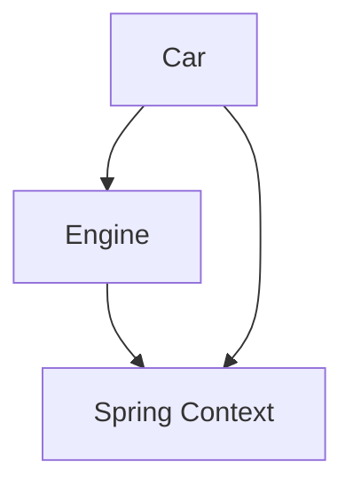

# Wiring Beans

The **Spring context** is a dedicated area in the application’s memory where Spring stores and manages the objects (beans) it controls. Any object that needs Spring features such as dependency injection, lifecycle management, or configuration must be added to this context.

In real applications, objects rarely work in isolation. One object often depends on another to perform part of its responsibility. Establishing these relationships between objects is called **wiring beans**. Spring provides multiple ways to define these relationships inside the application context.

---

## Ways to Establish Relationships Between Beans

Spring offers **three primary approaches** to wire beans together.

---

### 1. Direct Method Call Between `@Bean` Methods

One `@Bean` method can directly call another `@Bean` method. Spring is smart enough to understand that this call refers to a bean managed by the context. If the bean already exists, Spring does **not** create a new instance—it returns the existing one.

#### Example

```java
@Configuration
public class AppConfig {

    @Bean
    public Engine engine() {
        return new Engine();
    }

    @Bean
    public Car car() {
        return new Car(engine()); // Spring injects the managed Engine bean
    }
}
```

**Key point:**
- Even though `engine()` is called explicitly, Spring intercepts the call and provides the singleton instance from the context.
- If the engine bean already exists in the context, then instead of calling the engine() method, Spring will directly take the instance from its context. If the engine bean does not yet exist in the context, Spring calls the engine() method and returns the bean.
---

### 2. Method Parameters in `@Bean`

Instead of calling another `@Bean` method, you can declare dependencies as method parameters. When Spring sees parameters on a `@Bean` method, it automatically searches the context for matching beans and injects them.

#### Example

```java
@Configuration
public class AppConfig {

    @Bean
    public Engine engine() {
        return new Engine();
    }

    @Bean
    public Car car(Engine engine) {
        return new Car(engine); // Dependency injected by Spring
    }
}
```

**Why this is better:**
- Cleaner code
- No tight coupling between configuration methods
- Easier to test and refactor
#### Without IoC 
- The application executes and controls(uses) the dependencies it needs.

#### With IoC
- The application executes being controlled by the framework(dependency)

> - **Inversion of Control (IoC)** means the framework controls the application flow and object lifecycle.
> - **Dependency Injection (DI)** is the mechanism by which the framework supplies required dependencies to the application. 
> - **Dependency Injection (DI)** is a technique in which the framework supplies a value to a specific field, constructor parameter, or method parameter. In this scenario, Spring provides the required value to the parameter of the car() method when invoking it, thereby resolving the dependency needed by that method. DI is a concrete implementation of the Inversion of Control (IoC) principle, and IoC means that the framework governs the application’s behavior during execution.
> - An application that does not apply the IoC principle manages its own execution flow and directly creates or uses its dependencies. In contrast, ***an application that follows the IoC principle hands over this control to a dependency***, typically a framework. Dependency Injection is one such form of control inversion, where the framework itself injects values into the application’s objects, such as assigning a dependency to a field of an application class.
---

### 3. Using `@Autowired`

The `@Autowired` annotation instructs Spring to inject a dependency automatically from the context. It can be used in **three different places**.

---

#### a. Field Injection

Spring injects the dependency directly into the field.

```java
@Component
public class Car {

    @Autowired
    private Engine engine;
}
```
**Notes:**
- The Stereotype annotation @Component instruct Spring to create a bean to Spring Context of this class: Car
- With @Autowired we instruct Spring to provide a bean from its context and set it directly as the value of the field `engine`. **This way we establish a relationship/wiring between the two beans**
- @Autowired annotation to tell Spring we want to inject a value there from its context.
- Common in demos and quick examples
- Not recommended for production code
- Harder to test and violates immutability

##### Component scanning must be enabled (this is mandatory)
- @Component only marks a class as a candidate.
- Spring will only create the bean if it scans that package. hence @ComponentScan is needed
```java
    @Configuration
    @ComponentScan(basePackages = "com.example.app")
    public class AppConfig {
    }
```
---

#### b. Constructor Injection (Recommended)

Spring injects dependencies through the constructor parameters.

```java
@Component
public class Car {

    private final Engine engine;

    @Autowired
    public Car(Engine engine) {
        this.engine = engine;
    }
}
```

**Why this is preferred in real-world applications:**
- Makes dependencies explicit
- Supports immutability
- Easier unit testing
- Prevents partially initialized objects

> If a class has only one constructor, `@Autowired` is optional.

---

#### c. Setter Injection

Spring injects the dependency using a setter method.

```java
@Component
public class Car {

    private Engine engine;

    @Autowired
    public void setEngine(Engine engine) {
        this.engine = engine;
    }
}
```

**Usage:**
- Rare in production code
- Useful for optional dependencies

---

## Dependency Injection and IoC

Whenever Spring provides an object reference through:
- a field,
- a constructor parameter, or
- a method parameter,

it is called **Dependency Injection (DI)**.

DI is a concrete implementation of the **Inversion of Control (IoC)** principle, where the framework controls object creation and wiring instead of the application code.

---

## Circular Dependencies

A **circular dependency** occurs when two beans depend on each other directly or indirectly.

```text
Bean A → Bean B
Bean B → Bean A
```

### Example

```java
@Component
class A {
    @Autowired
    B b;
}

@Component
class B {
    @Autowired
    A a;
}
```
❌ Spring cannot resolve this and throws an exception during startup.
```java
BeanCurrentlyInCreationException: Error creating bean with name 'b':
Requested bean is currently in creation: Is there an unresolvable circular reference?
```


**Rule:** Always design beans to avoid circular dependencies.

---

## Multiple Beans of the Same Type

When multiple beans of the same type exist in the context, Spring cannot decide which one to inject automatically.

Spring provides **two solutions**.

---

### 1. Using `@Primary`

Mark one bean as the default choice.

```java
@Bean
@Primary
public Engine petrolEngine() {
    return new PetrolEngine();
}

@Bean
public Engine dieselEngine() {
    return new DieselEngine();
}
```

Spring injects `petrolEngine` unless specified otherwise.

---

### 2. Using `@Qualifier`

Explicitly specify which bean to inject by name.

```java
@Component
public class Car {

    private final Engine engine;

    @Autowired
    public Car(@Qualifier("dieselEngine") Engine engine) {
        this.engine = engine;
    }
}
```

---

## Bean Wiring Overview Diagram



---

## Key Takeaways

- Spring context manages application beans
- Beans can be wired using `@Bean` methods or `@Autowired`
- Constructor injection is the recommended approach
- Circular dependencies must be avoided
- Use `@Primary` or `@Qualifier` when multiple beans of the same type exist

