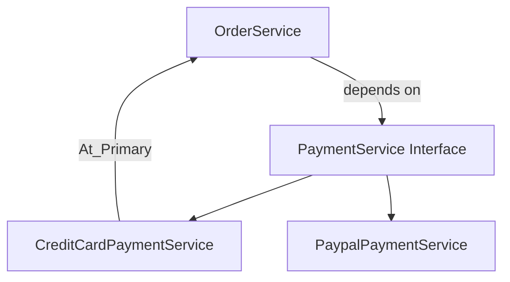

# Decoupling, Abstractions, and Dependency Injection in Spring

As a software engineer, designing systems that are **easy to change, extend, and maintain** is critical. One of the most effective ways to achieve this is by **decoupling implementations from their usage**.

Decoupling means that a class should depend on **abstractions**, not concrete implementations. This allows you to change an implementation without impacting many parts of the application.

---

## Abstractions and Interfaces in Java

In Java, **interfaces** are the primary way to achieve abstraction. An interface defines a **contract**—it specifies *what* a class should do, not *how* it does it.

```java
public interface PaymentService {
    void pay(double amount);
}
```

Concrete classes implement this contract:

```java
public class CreditCardPaymentService implements PaymentService {
    public void pay(double amount) {
        System.out.println("Paid using credit card: " + amount);
    }
}
```

The consumer depends only on the interface, not the implementation:

```java
public class OrderService {
    private final PaymentService paymentService;

    public OrderService(PaymentService paymentService) {
        this.paymentService = paymentService;
    }
}
```

This design makes the system flexible and testable.

---

## Dependency Injection in Spring

When using **dependency injection (DI)** with Spring, the framework is responsible for creating objects and injecting their dependencies.

If a constructor or field expects an interface, Spring searches its **application context** for a bean that implements that interface and injects it automatically.

```java
@Service
public class CreditCardPaymentService implements PaymentService {
}
```

Spring does not create beans for interfaces—only for concrete classes.

---

## Stereotype Annotations

Spring uses **stereotype annotations** to identify classes that should be managed as beans. These annotations are applied **only to classes**, never to interfaces.

Common stereotypes:
- `@Component` – Generic Spring-managed component
- `@Service` – Business or service-layer logic
- `@Repository` – Data access and persistence logic

Using specialized stereotypes improves readability and clearly communicates a class’s responsibility.

```java
@Repository
public class UserRepository {
}
```

---

## Multiple Implementations and Bean Resolution

When the Spring context contains **multiple beans implementing the same interface**, Spring cannot decide which one to inject without additional information.

### Using `@Primary`

`@Primary` marks one implementation as the **default choice**.

```java
@Service
@Primary
public class CreditCardPaymentService implements PaymentService {
}
```

Spring will inject this implementation unless instructed otherwise.

### Using `@Qualifier`

`@Qualifier` allows you to **explicitly specify** which bean should be injected.

```java
@Service("paypalPaymentService")
public class PaypalPaymentService implements PaymentService {
}
```

```java
public OrderService(@Qualifier("paypalPaymentService") PaymentService paymentService) {
    this.paymentService = paymentService;
}
```

---

## Conceptual Flow Diagram



---

## Key Takeaways

- Always depend on **interfaces**, not concrete classes
- Interfaces define **contracts** between components
- Spring injects implementations using **dependency injection**
- Use stereotype annotations to clearly express responsibility
- Resolve multiple implementations using `@Primary` or `@Qualifier`

This approach results in clean, extensible, and maintainable Spring applications—an essential expectation for senior-level interviews.

# Top 10 Questions -- Abstraction & Dependency Injection in Spring

## 1. Why do we prefer interfaces over concrete classes in Spring?
We prefer interfaces because they promote loose coupling. A class depending on an interface depends only on a contract, not on a specific implementation. This makes the system easier to extend, test, and modify.

## 2. How does Spring decide which bean to inject when an interface is used?
Spring injects dependencies primarily by type. If only one implementation exists, it is injected automatically.

## 3. What happens if multiple beans implement the same interface?
Spring throws NoUniqueBeanDefinitionException. You must resolve it using `@Primary` or `@Qualifier`.

## 4. Difference between `@Primary` and `@Qualifier`?
`@Primary` defines the default bean. `@Qualifier` explicitly selects a specific bean when multiple implementations exist.

## 5. Why don't we put stereotype annotations on interfaces?
Interfaces cannot be instantiated. Spring creates beans only from concrete classes.

## 6. Difference between `@Component`, `@Service`, and `@Repository`?
`@Component` is generic. `@Service` indicates business logic. `@Repository` indicates data access logic and enables exception translation.

## 7. What is dependency injection and how is it different from using new?
DI provides dependencies externally. Using new creates tight coupling and reduces flexibility.

## 8. How does constructor injection improve testability?
Dependencies are explicit and easy to mock, allowing unit testing without Spring container.

## 9. What problems does tight coupling cause?
Harder maintenance, poor testability, low flexibility, higher regression risk.

## 10. How would you refactor tightly coupled code?
Introduce an interface, move implementation logic to a class, and inject the abstraction using constructor injection.

# Memories
> “I usually default to interface-based design with constructor injection, and only introduce qualifiers when behavior needs to differ explicitly.”\
> Spring injects by type first, then by qualifier/name if needed.\
> Using @Component for Everything Loses semantic meaning , Instead use `@Service` and `@Repository` as required.\
> “In Spring-based applications, we strongly prefer decoupling implementations using abstractions, typically Java interfaces.\
The idea is that a class should depend on what another class does, not how it does it. This makes the system easier to change, extend, and test.\
> In Java, interfaces act as contracts. When a service depends on an interface, it doesn’t care which concrete implementation it gets. Spring’s dependency injection container is responsible for finding a suitable implementation and injecting it at runtime.\
> Spring creates beans only for concrete classes, which are marked using stereotype annotations like @Service, @Repository, or @Component. We never annotate interfaces because they don’t represent instantiable objects.\
> If there is only one implementation of an interface, Spring injects it automatically. However, if multiple implementations exist, Spring needs guidance. We can either mark one implementation as the default using @Primary, or explicitly select one using @Qualifier.\
> Using specialized stereotypes like @Service and @Repository improves readability and clearly communicates responsibility, which is important in large codebases.\
> Overall, this approach results in loosely coupled, maintainable, and testable applications — which is why it’s a core design principle in Spring.”
