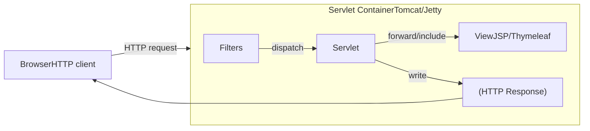
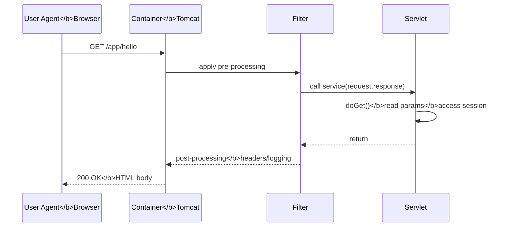

# From Servlets to Spring: A Newbie‑Friendly Guide to Building Java Web Applications

> **Goal:** Make you productive with the *Servlet* model—the fundamental building block of Java web apps—then show how Spring MVC/Spring Boot sit on top of it.
>
> **Who is this for?** New developers and anyone who wants a clear mental model of request handling, sessions, filters, listeners, deployment, and how Spring builds on the Servlet API.

---

## Why Servlets? The Big Picture
- A **Servlet** is a Java class that runs inside a **Servlet container** (e.g., Tomcat, Jetty) and **handles HTTP requests**.
- Frameworks like **Spring MVC** ultimately delegate HTTP handling to the **Servlet API** via `DispatcherServlet`.
- Understanding **Servlets** gives you:
  - Clarity on the **request→filter→servlet→view** pipeline
  - Control over **sessions**, **security headers**, **encoding**, **error pages**
  - A solid base to reason about Spring MVC & Spring Boot behavior

### End‑to‑End flow (mental map)


---

## HTTP & the Servlet Container
- **Servlet container** manages:
  - Socket handling, HTTP parsing, **thread pooling**
  - Lifecycle of **Filters**, **Servlets**, **Listeners**
  - Routing based on **URL patterns** (e.g., `/api/*`, `*.do`)
- Requests hit the container, pass through **Filter** chain, then reach the **target servlet**.

### Minimal request lifecycle (sequence)


---

## Servlet Lifecycle & Core Interfaces
**Key interfaces/classes:**
- `Servlet` (and `GenericServlet`), `HttpServlet`
- `ServletConfig`, `ServletContext`
- `ServletRequest`, `ServletResponse` and their HTTP variants

**Lifecycle methods (HttpServlet):**
- `init(ServletConfig cfg)` → one‑time init
- `service(HttpServletRequest req, HttpServletResponse resp)` → dispatches to `doGet`, `doPost`, etc.
- `destroy()` → cleanup on undeploy/shutdown

### HelloServlet (annotations)
> **Note:** Modern stacks (Tomcat 10+/Spring Boot 3+) use **`jakarta.*`** packages, not `javax.*`.

```java
package com.example.web;

import java.io.IOException;
import jakarta.servlet.ServletException;
import jakarta.servlet.annotation.WebServlet;
import jakarta.servlet.http.HttpServlet;
import jakarta.servlet.http.HttpServletRequest;
import jakarta.servlet.http.HttpServletResponse;

@WebServlet(name = "helloServlet", urlPatterns = "/hello")
public class HelloServlet extends HttpServlet {
    @Override
    protected void doGet(HttpServletRequest req, HttpServletResponse resp)
            throws ServletException, IOException {
        resp.setContentType("text/html;charset=UTF-8");
        var out = resp.getWriter();
        String name = req.getParameter("name");
        if (name == null || name.isBlank()) name = "World";
        out.println("<h1>Hello, " + name + "!</h1>");
    }
}
```

### web.xml (descriptor) vs annotations
- **Annotations** (`@WebServlet`, `@WebFilter`, `@WebListener`) are concise for simple setups.
- **`web.xml`** is great for centralized config, multiple envs, or when you cannot modify code.

```xml
<!-- WEB-INF/web.xml -->
<web-app xmlns="https://jakarta.ee/xml/ns/jakartaee"
         xmlns:xsi="http://www.w3.org/2001/XMLSchema-instance"
         xsi:schemaLocation="https://jakarta.ee/xml/ns/jakartaee https://jakarta.ee/xml/ns/jakartaee/web-app_5_0.xsd"
         version="5.0">

  <servlet>
    <servlet-name>helloServlet</servlet-name>
    <servlet-class>com.example.web.HelloServlet</servlet-class>
  </servlet>
  <servlet-mapping>
    <servlet-name>helloServlet</servlet-name>
    <url-pattern>/hello</url-pattern>
  </servlet-mapping>
</web-app>
```

---

## Threading & State: What’s Safe/Unsafe
- Containers create **one Servlet instance** by default and use **multiple threads** to call it.
- **Do not** store per‑request data in **instance fields**; use **local variables**.
- If you must keep shared state, use thread‑safe structures (e.g., `AtomicInteger`, `ConcurrentHashMap`).

### Unsafe vs Safe counter example
```java
// UNSAFE: instance field mutated by many threads
public class BadCounterServlet extends HttpServlet {
    private int counter = 0; // race conditions!
    protected void doGet(HttpServletRequest req, HttpServletResponse resp)
            throws IOException {
        counter++; // not atomic
        resp.getWriter().println("Count=" + counter);
    }
}
```

```java
// SAFE: use AtomicInteger OR compute purely in local vars
public class GoodCounterServlet extends HttpServlet {
    private final java.util.concurrent.atomic.AtomicInteger counter = new java.util.concurrent.atomic.AtomicInteger();
    protected void doGet(HttpServletRequest req, HttpServletResponse resp)
            throws IOException {
        int value = counter.incrementAndGet();
        resp.getWriter().println("Count=" + value);
    }
}
```

**Rule of thumb:**
- **Local variables** inside `doGet`/`doPost` are safe.
- Any **mutable field** on the servlet must be **synchronized** or **concurrent**.

---

## Filters, Listeners & Request Dispatching
### Filters
- Wrap requests/responses for **cross‑cutting concerns**: logging, auth, CORS, compression, security headers.

```java
package com.example.web;

import jakarta.servlet.*;
import jakarta.servlet.annotation.WebFilter;
import jakarta.servlet.http.HttpServletResponse;
import java.io.IOException;

@WebFilter(urlPatterns = "/*")
public class LoggingCorsFilter implements Filter {
    public void doFilter(ServletRequest request, ServletResponse response, FilterChain chain)
            throws IOException, ServletException {
        long t0 = System.currentTimeMillis();

        // CORS example (simplified)
        HttpServletResponse resp = (HttpServletResponse) response;
        resp.setHeader("Access-Control-Allow-Origin", "*");
        resp.setHeader("Access-Control-Allow-Methods", "GET,POST");

        chain.doFilter(request, response); // proceed

        long dt = System.currentTimeMillis() - t0;
        System.out.println("Handled in " + dt + " ms");
    }
}
```

### Listeners
- Observe lifecycle events: **context**, **session**, **request** create/destroy, attribute changes.

```java
package com.example.web;

import jakarta.servlet.annotation.WebListener;
import jakarta.servlet.http.HttpSessionEvent;
import jakarta.servlet.http.HttpSessionListener;

@WebListener
public class SessionCounter implements HttpSessionListener {
    private static int active = 0;
    public void sessionCreated(HttpSessionEvent se) { active++; }
    public void sessionDestroyed(HttpSessionEvent se) { active--; }
    public static int getActiveSessions() { return active; }
}
```

### Forward vs Include
- **Forward**: server‑side handoff, URL bar **does not** change.
- **Include**: merge output of another resource into current response.

```java
// Forward to JSP
request.getRequestDispatcher("/WEB-INF/views/hello.jsp").forward(request, response);

// Include a header fragment
request.getRequestDispatcher("/WEB-INF/views/_header.jsp").include(request, response);
```

---

## Sessions: Cookies, URL Rewriting, Security
- Sessions track user state across stateless HTTP.
- Default: cookie named `JSESSIONID`.
- If cookies disabled, use **URL rewriting** with `response.encodeURL()` / `encodeRedirectURL()`.

```java
// Read & write session safely
var session = request.getSession(true); // create if missing
session.setAttribute("user", "alice");
String user = (String) session.getAttribute("user");

// Encode URL if cookies are off
String href = response.encodeURL(request.getContextPath() + "/profile");
response.getWriter().println("<a href='" + href + "'>Profile</a>");
```

**Security tips**
- Set session timeout & cookie security flags.
- Regenerate session ID **after login** (prevents fixation).

```xml
<!-- web.xml session config -->
<session-config>
  <session-timeout>30</session-timeout> <!-- minutes -->
  <cookie-config>
    <http-only>true</http-only>
    <secure>true</secure> <!-- set when running over HTTPS -->
    <name>JSESSIONID</name>
    <path>/</path>
  </cookie-config>
  <tracking-mode>COOKIE</tracking-mode>
</session-config>
```

---

## Static vs Dynamic Content: JSP, Templates, and Views
- **JSP**: classic view tech compiled to servlets; supports JSTL, EL.
- **Modern apps** often prefer **Thymeleaf**, **Freemarker**, or **JSON APIs** rendered by JS frontends.
- Regardless of view tech, **servlet writes the response** (directly or via view engine).

---

## From Servlets to Spring MVC & Spring Boot
**Key idea:** Spring MVC lives **on top of the Servlet API** using **`DispatcherServlet`**.

- The container maps all requests (e.g., `/*`) to **DispatcherServlet**.
- DispatcherServlet applies **HandlerMappings → Interceptors → Controllers → ViewResolvers**.
- All still within the **same thread & HttpServletRequest/Response** per request.

### Minimal Spring Boot REST example
```java
package com.example.demo;

import org.springframework.boot.SpringApplication;
import org.springframework.boot.autoconfigure.SpringBootApplication;
import org.springframework.web.bind.annotation.GetMapping;
import org.springframework.web.bind.annotation.RequestParam;
import org.springframework.web.bind.annotation.RestController;

@SpringBootApplication
public class DemoApplication {
  public static void main(String[] args) {
    SpringApplication.run(DemoApplication.class, args);
  }
}

@RestController
class HelloController {
  @GetMapping("/hello")
  public String hello(@RequestParam(defaultValue = "World") String name) {
    return "Hello, " + name + "!";
  }
}
```

> Under the hood, Spring Boot autoconfigures an **embedded Tomcat** (a Servlet container) and registers a **DispatcherServlet**.

---

## Project Layouts, Build, Deploy (WAR & Embedded)
### Classic WAR (Servlet + JSP) with Maven
```
myapp/
  src/
    main/
      java/com/example/web/... (servlets, filters, listeners)
      webapp/
        WEB-INF/
          web.xml
          views/
            hello.jsp
  pom.xml
```

**`pom.xml` (Servlet 5, WAR packaging):**
```xml
<project ...>
  <modelVersion>4.0.0</modelVersion>
  <groupId>com.example</groupId>
  <artifactId>myapp</artifactId>
  <version>1.0.0</version>
  <packaging>war</packaging>

  <dependencies>
    <dependency>
      <groupId>jakarta.servlet</groupId>
      <artifactId>jakarta.servlet-api</artifactId>
      <version>6.0.0</version>
      <scope>provided</scope>
    </dependency>
    <!-- JSP / JSTL if you use JSPs -->
    <dependency>
      <groupId>jakarta.servlet.jsp.jstl</groupId>
      <artifactId>jakarta.servlet.jsp.jstl-api</artifactId>
      <version>3.0.0</version>
    </dependency>
  </dependencies>
</project>
```

**Build & Deploy:**
```bash
mvn clean package
# Copy target/myapp.war into TOMCAT_HOME/webapps/
# Tomcat will auto-deploy at http://localhost:8080/myapp
```

### Spring Boot (embedded container)
- **No external Tomcat needed** for dev; run the JAR.
- Still a **Servlet app**; Tomcat/Jetty/Undertow is embedded.

```bash
mvn spring-boot:run
# or
mvn -DskipTests clean package
java -jar target/demo-0.0.1-SNAPSHOT.jar
```

---

## Hands‑On Lab: Build a Minimal App
1. **Create a Maven WAR project** (or use your IDE archetype).
2. Add the **HelloServlet** (above) mapped to `/hello`.
3. Add a **LoggingCorsFilter**.
4. Add a **SessionCounter** listener.
5. Create a simple `hello.jsp`:
   ```jsp
   <%@ page contentType="text/html;charset=UTF-8" %>
   <html>
   <body>
     <h1>Hello JSP</h1>
     <p>User: ${sessionScope.user}</p>
   </body>
   </html>
   ```
6. In the servlet, forward to JSP:
   ```java
   request.setAttribute("greeting", "Hello from servlet");
   request.getRequestDispatcher("/WEB-INF/views/hello.jsp").forward(request, response);
   ```
7. **Build & deploy** to Tomcat; open:
   ```bash
   curl -i "http://localhost:8080/myapp/hello?name=Imran"
   ```

---

## Common Pitfalls & How to Avoid Them
- **`javax.*` vs `jakarta.*` mixups:** Spring Boot 3+/Tomcat 10+ require **`jakarta.*`** imports. Fix dependencies and imports consistently.
- **Thread‑unsafe fields:** Keep request data in **local vars**; use `Atomic*`/concurrent collections for shared state.
- **Wrong content type/encoding:** Always set `resp.setContentType("text/html;charset=UTF-8")` or `application/json`.
- **Not closing writers/streams:** Use try‑with‑resources or let the container manage `PrintWriter` from `getWriter()`.
- **Hard‑coded URLs:** Use `request.getContextPath()` and `encodeURL`.
- **Session fixation:** After login, call `session.invalidate()` then `request.getSession(true)` and set the user again.
- **CORS headaches:** Handle **OPTIONS** preflight and set `Access-Control-Allow-*` headers appropriately in a Filter.

---

## Where Your 3 Pictures & Descriptions Fit
> You mentioned you have **3 pictures** and **3 descriptions**. Here’s how to place them in this guide. Replace the image paths and edit the captions.

1. **High‑level Architecture** (browser → container → filters → servlets → views)
   ```markdown
   
   *Use with*: [Why Servlets? The Big Picture](#why-servlets-the-big-picture)
   *Description*: Explain user request hitting Tomcat, passing through filters, reaching your core servlet, then a JSP/JSON response.
   ```

2. **Request Lifecycle (detailed)**
   ```markdown
   
   *Use with*: [HTTP & the Servlet Container](#http--the-servlet-container)
   *Description*: Show thread handling, mapping to URL patterns, and the filter chain order.
   ```

3. **Session & Security**
   ```markdown
   
   *Use with*: [Sessions: Cookies, URL Rewriting, Security](#sessions-cookies-url-rewriting-security)
   *Description*: Depict JSESSIONID cookie, URL rewriting fallback, and regeneration after login.
   ```

---

## Appendix: Glossary & Quick Reference
- **Servlet**: Java class handling HTTP requests in a container.
- **Filter**: Pre/post processing around a request.
- **Listener**: Hook for lifecycle events (context/session/request).
- **ServletContext**: App‑wide context shared by servlets.
- **ServletConfig**: Per‑servlet init config.
- **DispatcherServlet**: Spring MVC front controller bridging to controllers.
- **WAR**: Web ARchive—packaged web app for containers like Tomcat.
- **Embedded Container**: A server (Tomcat/Jetty) started inside your app, common in Spring Boot.

### Quick snippets
```java
// Read header & param
String agent = request.getHeader("User-Agent");
String q = request.getParameter("q");

// JSON response
response.setContentType("application/json;charset=UTF-8");
response.getWriter().write("{\"ok\":true}");

// Send redirect
response.sendRedirect(response.encodeRedirectURL(request.getContextPath() + "/login"));

// Error handling
response.sendError(HttpServletResponse.SC_FORBIDDEN, "Not allowed");
```

---

### Next steps
- If you upload your **3 images** and **descriptions**, I’ll embed them directly into this file.
- Want a **Spring MVC** version of the lab (controllers, views, validation)? I can add it as a second module.

