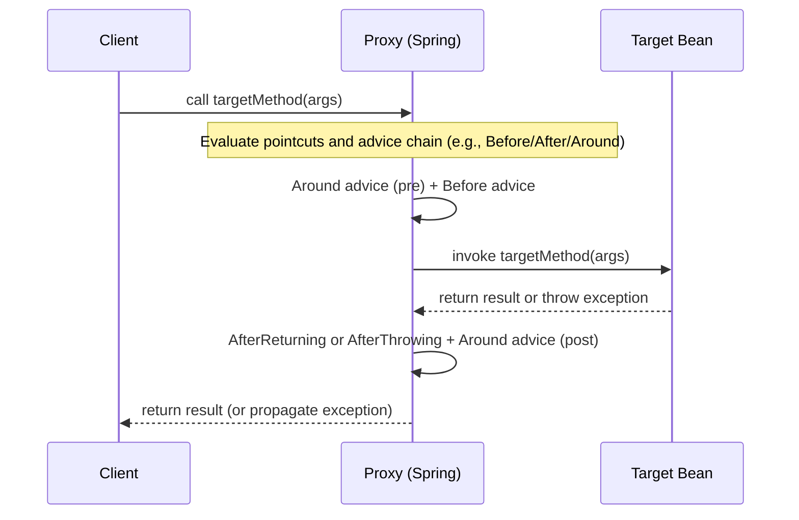
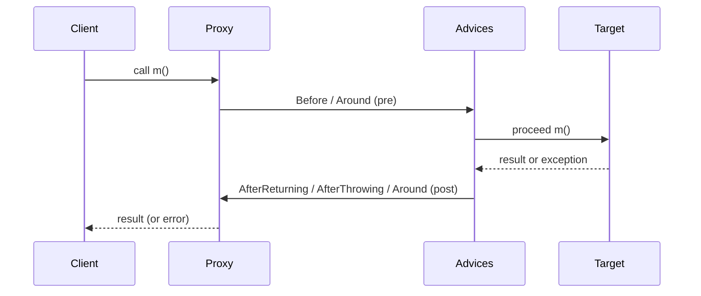

# Spring AOP — A Deep, Practical Guide (Story + Concepts + Code)

---

## 1) The Story: Why Do We Need AOP?

Imagine you’re building a payments platform with microservices:

- **OrderService** places orders.
- **PaymentService** charges cards.
- **InventoryService** reserves stock.

Across all these services you must also handle **cross-cutting concerns**:

- **Security**: authorization checks.</b>
- **Observability**: logging, tracing, metrics.</b>
- **Reliability**: retries, circuit breakers.</b>
- **Auditing**: who did what and when.</b>
- **Transactions**: consistent units of work.

If you implement each of these in every method, your code becomes:

- **Duplicated** (same logging, same checks copied everywhere).</b>
- **Brittle** (forget one place, you introduce a security hole).</b>
- **Hard to evolve** (change logging format → edit 200 methods).</b>

**Aspect-Oriented Programming (AOP)** lets you implement such concerns **once** and **apply them declaratively** to many methods/classes. You keep business code clean, and you keep cross-cutting logic centralized, testable, and consistent.

---

## 2) Core Terminology

- **Aspect**: A module that encapsulates a cross-cutting concern (e.g., logging, security).
- **Advice**: *When* the aspect runs relative to the method: `@Before`, `@AfterReturning`, `@AfterThrowing`, `@After`, `@Around`.</b>
- **Pointcut**: *Where* to apply the aspect—an expression selecting join points (e.g., all public methods in a package).</b>
- **Join Point**: A point in program execution where an aspect can be applied (in Spring AOP: method execution).
- **Target Object**: The bean whose method is being advised.</b>
- **Proxy**: The object Spring gives you instead of the real bean; it intercepts calls, runs advice, and then delegates to the target.</b>
- **Weaving**: The process of linking aspects with other application code. In Spring AOP this is done at runtime via proxies.

**Important scope**: Spring AOP is **proxy-based** and therefore applies to **public method executions on Spring-managed beans**.

---

## 3) How Delegation Works (Proxy → Target)

When a method isn’t aspected, you call it directly. When it *is* aspected, you actually call a **proxy** that wraps the target and applies advice.

### Mermaid: Delegation via Proxy


---

## 4) Step-by-Step: Creating an Aspect in Spring

1. **Enable AOP** in a configuration class: `@EnableAspectJAutoProxy`.
2. **Declare an aspect**: annotate a class with `@Aspect` and register it as a bean.
3. **Define advice**: annotate methods with advice annotations and specify pointcuts.
4. **Implement logic**: within advice methods, implement logging, security, metrics, etc.

### Minimal Example

**Configuration**
```java
@Configuration
@ComponentScan(basePackages = "com.example.demo.service")
@EnableAspectJAutoProxy
public class ProjectConfig {

    @Bean
    public LoggingAspect logginAspect(){
        return new LoggingAspect();
    }
}
```

**Business Service**
```java
@Service
public class CommentService {
    //private Logger logger = Logger.getLogger(CommentService.class.getName());
    public void publishComment(Comment comment) {
        //logger.info("Publishing comment:" + comment.getText());
        System.out.println("Publishing comment:" + comment.getText());
    }
}
```

**Aspect (Logging + Timing)**
```java
    @Aspect
    public class LoggingAspect {
        @Around("execution(* com.example.demo.service.*.*(..))")
        public void log(ProceedingJoinPoint joinPoint) throws Throwable {
            System.out.println("Aspect got called. Before");
            joinPoint.proceed();
            System.out.println("Aspect got called. After");
        }
    }
```
```java
// Still need to read more to understand it.
@Aspect
@Component
public class LoggingAspect {

    // Pointcut: all public methods in service package
    @Pointcut("execution(public * com.example..service..*(..))")
    public void anyServicePublicMethod() {}

    @Before("anyServicePublicMethod()")
    public void logBefore(JoinPoint jp) {
        String method = jp.getSignature().toShortString();
        Object[] args = jp.getArgs();
        System.out.println("[AOP] Enter: " + method + " args=" + Arrays.toString(args));
    }

    @AfterReturning(pointcut = "anyServicePublicMethod()", returning = "ret")
    public void logAfterReturning(JoinPoint jp, Object ret) {
        String method = jp.getSignature().toShortString();
        System.out.println("[AOP] Return: " + method + " -> " + ret);
    }

    @AfterThrowing(pointcut = "anyServicePublicMethod()", throwing = "ex")
    public void logAfterThrowing(JoinPoint jp, Throwable ex) {
        String method = jp.getSignature().toShortString();
        System.err.println("[AOP] Exception in: " + method + " : " + ex.getMessage());
    }

    @Around("anyServicePublicMethod()")
    public Object timeAround(ProceedingJoinPoint pjp) throws Throwable {
        long start = System.nanoTime();
        try {
            return pjp.proceed();
        } finally {
            long end = System.nanoTime();
            String method = pjp.getSignature().toShortString();
            System.out.println("[AOP] Time: " + method + " took " + (end - start)/1_000_000.0 + " ms");
        }
    }
}
```

---

## 5) Pointcut Expressions (Essentials)

Spring uses a subset of AspectJ pointcut expressions. Common patterns:

- **`execution(modifiers? return-type declaring-type? method-name(param-pattern) throws?)`**
  - Examples:
    - `execution(* com.example..service..*(..))` → any method in `..service..` packages.</b>
    - `execution(public * *(..))` → any public method.</b>
    - `execution(* *(String, ..))` → first parameter is `String`.</b>
- **`within(type-pattern)`**
  - `within(com.example..controller..*)` → any join point in matched types.
- **`this(type)`** and **`target(type)`**
  - `this(MyInterface)` selects join points where the proxy is assignable to `MyInterface`.</b>
  - `target(MyClass)` selects join points where the target is `MyClass`.
- **`args(type-patterns)`**
  - Binds runtime argument types/values for use in advice parameters.
- **Annotation-based**
  - `@annotation(YourAnnotation)` → match methods annotated with `@YourAnnotation`.
  - `@within(YourAnnotation)` / `@target(YourAnnotation)` → type-level annotations.

### Binding Arguments, Return, and Annotations
```java
@Around("execution(* com.example..*(..)) && args(orderId, ..)")
public Object aroundWithArg(ProceedingJoinPoint pjp, String orderId) throws Throwable {
    System.out.println("OrderId = " + orderId);
    return pjp.proceed();
}

@AfterReturning(pointcut = "execution(* com.example..*(..))", returning = "ret")
public void afterReturning(Object ret) { /* use ret */ }

@Before("@annotation(com.example.security.RequiresAdmin)")
public void checkAdmin() { /* enforce role */ }
```

---

## 6) Advice Types and Control Flow

- **`@Before`** — runs before method execution.</b>
- **`@AfterReturning`** — runs after successful return; can access the return value.</b>
- **`@AfterThrowing`** — runs if method throws; can access the exception.</b>
- **`@After`** — always runs (finally block semantics).</b>
- **`@Around`** — wraps the call; can prevent, modify, or replace execution (most powerful). Must call `proceed()` to continue.

### Mermaid: Advice Chain Around a Call


---

## 7) Proxies in Spring: JDK vs CGLIB

- **JDK Dynamic Proxies**: used when the target bean implements at least one interface. The proxy **implements the same interfaces**; callers typed by the interface are advised.
- **CGLIB Subclass Proxies**: used when no interface is present; Spring generates a subclass at runtime. **Final methods/classes cannot be advised** because subclassing cannot override finals.

**Configuration Tweaks**
```java
@EnableAspectJAutoProxy(proxyTargetClass = true) // force CGLIB even if interface exists
```

**Pitfalls**
- **Self-invocation**: calling an advised method from another method within the same bean bypasses the proxy → advice won’t run. Workarounds:
  - Refactor the advised method into another bean and inject it.</b>
  - Use `@EnableAspectJAutoProxy(exposeProxy = true)` and obtain the proxy via `AopContext.currentProxy()` (use sparingly).

```java
@EnableAspectJAutoProxy(exposeProxy = true)
public class AopConfig {}

@Service
class ReportService {
    public void outer() {
        // self-invocation (bypasses proxy): advice on inner() will NOT run
        inner();

        // correct: obtain proxy and call through it so advices apply
        ((ReportService) AopContext.currentProxy()).inner();
    }

    public void inner() { /* advised */ }
}
```

---

## 8) Applying AOP to Real Cross-Cutting Concerns

### 8.1 Structured Logging & Correlation IDs
```java
@Target(ElementType.METHOD)
@Retention(RetentionPolicy.RUNTIME)
public @interface Logged {}

@Aspect
@Component
public class CorrelatedLoggingAspect {

    @Around("@annotation(Logged)")
    public Object correlated(ProceedingJoinPoint pjp) throws Throwable {
        String cid = Optional.ofNullable(MDC.get("cid")).orElse(UUID.randomUUID().toString());
        MDC.put("cid", cid);
        long t0 = System.currentTimeMillis();
        try {
            System.out.println("cid=" + cid + " enter " + pjp.getSignature());
            return pjp.proceed();
        } finally {
            long dt = System.currentTimeMillis() - t0;
            System.out.println("cid=" + cid + " exit " + pjp.getSignature() + " dt=" + dt + "ms");
        }
    }
}

@Service
public class CheckoutService {
    @Logged
    public String checkout(String cartId) { return "ok"; }
}
```

### 8.2 Security Guards
```java
@Target(ElementType.METHOD)
@Retention(RetentionPolicy.RUNTIME)
public @interface RequiresRole { String value(); }

@Aspect
@Component
public class SecurityAspect {

    @Before("@annotation(req)")
    public void check(RequiresRole req) {
        String role = req.value();
        if (!SecurityContext.hasRole(role)) {
            throw new AccessDeniedException("Missing role " + role);
        }
    }
}
```

### 8.3 Retry (Idempotent Operations)
```java
@Target(ElementType.METHOD)
@Retention(RetentionPolicy.RUNTIME)
public @interface Retryable { int attempts() default 3; long backoffMs() default 200; }

@Aspect
@Component
public class RetryAspect {
    @Around("@annotation(retryable)")
    public Object around(ProceedingJoinPoint pjp, Retryable retryable) throws Throwable {
        int attempts = retryable.attempts();
        long backoff = retryable.backoffMs();
        int i = 0;
        while (true) {
            try {
                return pjp.proceed();
            } catch (Throwable t) {
                i++;
                if (i >= attempts) throw t;
                Thread.sleep(backoff);
            }
        }
    }
}
```

> **Note:** In production, consider Spring Retry or Resilience4j for polished implementations.

### 8.4 Auditing
```java
@Target(ElementType.METHOD)
@Retention(RetentionPolicy.RUNTIME)
public @interface Audited { String action(); }

@Aspect
@Component
public class AuditAspect {
    @AfterReturning("@annotation(a)")
    public void audit(Audited a) {
        AuditLog.record(a.action(), SecurityContext.user());
    }
}
```

---

## 9) Transactions and AOP

`@Transactional` is implemented via AOP proxies. The transaction begins **before** your method and commits/rolls back **after** it returns/throws. Same proxy caveats apply (public methods, self-invocation issues, final methods).

```java
@Service
public class OrderService {

    @Transactional
    public void placeOrder(String orderId) {
        // DB writes here are part of a transaction
        reserveInventory(orderId); // self-invocation might bypass @Transactional if called within same class
    }
}
```

To ensure inner calls are transactional, move them to another bean or call through the proxy (`AopContext`).

---

## 10) Exception Handling in Advices

- In `@AfterThrowing`, you can log, record metrics, or translate exceptions.
- In `@Around`, you can catch, rethrow, or map exceptions.
- Be cautious not to **swallow** exceptions unintentionally.

```java
@Around("execution(* com.example..*(..))")
public Object wrap(ProceedingJoinPoint pjp) throws Throwable {
    try {
        return pjp.proceed();
    } catch (DomainException de) {
        // map to API-level exception or enrich
        throw new ApiException("BAD_REQUEST", de);
    }
}
```

---

## 11) Ordering Multiple Aspects

Use `@Order` to control the order of multiple aspects. Lower values have higher precedence.

```java
@Aspect
@Order(1)
@Component
class SecurityAspect { /* runs first around the join point */ }

@Aspect
@Order(2)
@Component
class LoggingAspect { /* runs after SecurityAspect */ }
```

The order affects nesting of `@Around` advices and the visible behavior (e.g., which logger sees exceptions).

---

## 12) Performance Considerations

- Proxies add a small overhead per invocation (~nanoseconds to micro/milliseconds depending on advice and work).</b>
- Minimize expensive logic in advices (I/O, blocking calls) unless explicitly desired.</b>
- Pointcuts that are too broad can produce unexpected interception and overhead—narrow them with packages/annotations.

Benchmark critical paths with and without aspects to make informed trade-offs.

---

## 13) Testing AOP

- **Unit-test advice** by instantiating the aspect class and calling advice methods with mocked `JoinPoint`/`ProceedingJoinPoint`.
- **Slice tests** with Spring context: load beans + aspect and assert side effects (logs, metrics, security).
- **Integration tests**: verify behavior across layers (transaction boundaries, retries, auditing records).

```java
@SpringBootTest
class AopIT {
    @Autowired CheckoutService checkout;

    @Test
    void logsAndTimes() {
        String r = checkout.checkout("c1");
        assertEquals("ok", r);
        // assert logs/metrics via appender or meter registry
    }
}
```

---

## 14) Advanced: Beyond Spring AOP (Full AspectJ)

Spring AOP is proxy-based and limited to method execution join points on Spring beans. **AspectJ** (compile-time or load-time weaving) supports richer join points (field set/get, constructors, static initializers) and can advise calls inside the same class without proxy limitations.

- **Compile-Time Weaving (CTW)**: aspects woven during build; produces woven bytecode.
- **Load-Time Weaving (LTW)**: weaving by Java agent at class load; Spring supports LTW via `spring-instrument`.

Use full AspectJ when you need:
- Non-Spring-managed objects or non-public methods advised.</b>
- Field access or constructor join points.</b>
- Avoidance of proxy/self-invocation limitations.

---

## 15) Common Pitfalls & How to Avoid Them

1. **Self-invocation**: advice not applied when calling another method within same bean.
   - *Fix*: refactor to another bean or use `AopContext` with `exposeProxy=true`.
2. **Final methods/classes** with CGLIB: can’t be advised.
   - *Fix*: avoid `final` or use interfaces/JDK proxies.
3. **Method visibility**: only **public** methods are advised by Spring’s `@Transactional` and many standard advices.
   - *Fix*: design APIs with public methods at boundaries.
4. **Proxy type mismatch**: injecting concrete class vs interface can break if using JDK proxies.
   - *Fix*: prefer interface-typed injections or force CGLIB (`proxyTargetClass=true`).
5. **Too-broad pointcuts** causing accidental advice.
   - *Fix*: scope by package/annotation and add tests.
6. **Swallowing exceptions** in `@Around`.
   - *Fix*: rethrow or map appropriately; document behaviors.
7. **Order of aspects** not defined.
   - *Fix*: use `@Order`.

---

## 16) Putting It Together: AOP for a Payments Story

**Goal:** apply consistent logging, metrics, security role checks, and retry for idempotent operations.

**Annotations**
```java
@Retention(RetentionPolicy.RUNTIME)
@Target(ElementType.METHOD)
public @interface Logged {}

@Retention(RetentionPolicy.RUNTIME)
@Target(ElementType.METHOD)
public @interface RequiresRole { String value(); }

@Retention(RetentionPolicy.RUNTIME)
@Target(ElementType.METHOD)
public @interface Timed {}

@Retention(RetentionPolicy.RUNTIME)
@Target(ElementType.METHOD)
public @interface Retryable { int attempts() default 3; long backoffMs() default 100; }
```

**Aspects**
```java
@Aspect
@Order(1)
@Component
class SecurityAspect {
    @Before("@annotation(req)")
    void guard(RequiresRole req) {
        if (!SecurityContext.hasRole(req.value())) throw new AccessDeniedException("denied");
    }
}

@Aspect
@Order(2)
@Component
class LoggingAndTimingAspect {
    @Around("@annotation(Logged) || @annotation(Timed)")
    Object logAndTime(ProceedingJoinPoint pjp) throws Throwable {
        long t0 = System.nanoTime();
        System.out.println("enter " + pjp.getSignature());
        try { return pjp.proceed(); }
        finally {
            long dt = (System.nanoTime()-t0)/1_000_000;
            System.out.println("exit  " + pjp.getSignature() + " dt=" + dt + "ms");
        }
    }
}

@Aspect
@Order(3)
@Component
class RetryAspect {
    @Around("@annotation(r)")
    Object retry(ProceedingJoinPoint pjp, Retryable r) throws Throwable {
        int n = r.attempts(); long backoff = r.backoffMs();
        for (int i=1; ; i++) {
            try { return pjp.proceed(); }
            catch (Throwable t) { if (i>=n) throw t; Thread.sleep(backoff); }
        }
    }
}
```

**Service**
```java
@Service
class PaymentService {
    @Logged @Timed @RequiresRole("PAYMENTS_WRITE") @Retryable(attempts=3, backoffMs=200)
    public String charge(String orderId, int cents) {
        // charge via gateway; may throw transient errors
        return "TXN-" + orderId;
    }
}
```

This design keeps **business logic minimal** and moves cross-cutting logic into **reusable, testable aspects**.

---

## 17) FAQ / Subtle Questions

**Q: Can I change arguments or return values?**</b>
A: Yes, with `@Around` you can craft a new argument array (via reflection) or map return values. Be cautious with side effects and API contracts.

**Q: Can I intercept private/protected methods?**</b>
A: Not with Spring AOP proxies. Use full AspectJ (CTW/LTW) for that.

**Q: Can I advise non-Spring objects?**</b>
A: Not with Spring AOP, since weaving is by Spring’s proxies. Use AspectJ or make them Spring-managed.

**Q: Does AOP apply inside the same class?**</b>
A: Not by default (self-invocation issue). See section 7.

**Q: How do I debug pointcut matching?**</b>
A: Temporarily log from advice and print signatures/args; refine expressions. In tests, assert which methods were intercepted.

---

## 18) Quick Checklist (Production Readiness)

- [ ] Narrow pointcuts (package or annotations) to avoid accidental catch-all.</b>
- [ ] Decide proxy type (JDK vs CGLIB) and stick to interface-based DI if possible.</b>
- [ ] Handle self-invocation where needed.</b>
- [ ] Define `@Order` for multiple aspects.</b>
- [ ] Avoid heavy work in advices unless intended.</b>
- [ ] Provide clear annotations (e.g., `@Logged`, `@Audited`) with retention/runtime.</b>
- [ ] Test happy paths and failure paths with aspects enabled.</b>
- [ ] Document exception mapping behavior.

---

## 19) Additional Mermaid: High-Level AOP Weaving Concept
```mermaid
flowchart LR
    subgraph SpringContext
    Bean[Target Bean]
    Aspect[Aspect(s)]
    Proxy[Proxy Wrapper]
    end

    Client[Client Code] -->|getBean()/DI| Proxy
    Proxy -->|Matches Pointcut?</b> Yes| Aspect
    Aspect -->|Apply Advice</b> Around/Before/After| Bean
    Proxy -->|Matches Pointcut?</b> No| Bean
    Bean -->|Return/Throw| Proxy --> Client
```

---

## 20) Appendix: Common Pointcut Recipes

```java
// All public methods in a package (and subpackages)
execution(public * com.myapp..*(..))

// All methods annotated with @Audited
@annotation(com.myapp.audit.Audited)

// All methods of classes annotated with @RestController
within(@org.springframework.web.bind.annotation.RestController com.myapp..*)

// Methods whose first parameter is String
execution(* *(String, ..))

// Bind args for use in advice params
execution(* com.myapp..*(..)) && args(userId, ..)

// Proxy/target type sensitive
this(com.myapp.api.PaymentApi) // proxy implements PaymentApi

target(com.myapp.service.PaymentService) // target is PaymentService
```

---

### Final Takeaway

AOP in Spring gives you a **clean separation** between business logic and cross-cutting concerns via **proxy-based weaving**. Mastering pointcuts, advice types, and proxy behaviors (including pitfalls like self-invocation) lets you implement logging, security, metrics, retries, auditing, and transactions **consistently** and **safely** across your codebase.

