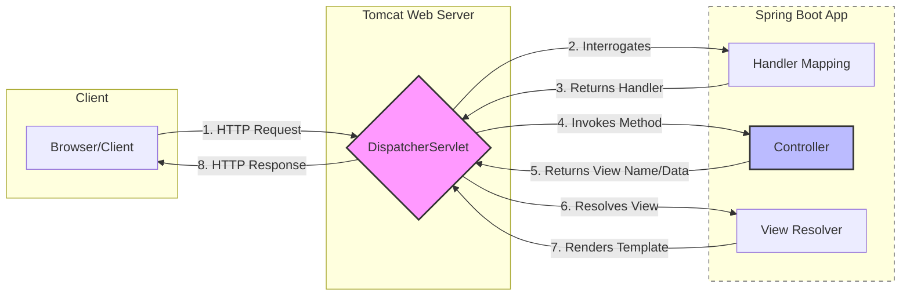

# Spring MVC Request Flow
This application follows the standard Spring Boot web request lifecycle using an embedded Apache Tomcat servlet container.



### 1. Request Initiation
The client (browser or API tool) sends an HTTP Request (GET, POST, etc.) to the server.

### 2. Front Controller (DispatcherServlet)
Tomcat receives the request and passes it to the DispatcherServlet. This acts as the Front Controller, centralizing all incoming traffic to manage the flow of the application.

### 3. Handler Mapping
The DispatcherServlet consults the HandlerMapping. It looks at the URL path and HTTP method to determine which specific @Controller and method (handler) should process the request.

### 4. Controller Execution
The DispatcherServlet dispatches the request to the identified Controller.

The Controller executes the business logic.

It returns a ModelAndView object (containing the data model and the logical view name).
The Controller returns the view name that the dispatcher servlet needs to find and rnder into the HTTP response.

### 5. View Resolution
The ViewResolver takes the logical view name (e.g., "dashboard") and resolves it to a physical resource (e.g., /WEB-INF/views/dashboard.jsp or a Thymeleaf template).

### 6. View Rendering
The DispatcherServlet renders the view by merging the model data with the template. The final HTTP Response is then sent back through Tomcat.

### 7. Client Presentation
The browser receives the response and renders the HTML/JSON data for the user.

> In addtion to returning the view name, we want to send data from controller to the view, whihc will be displayed byt hte view. This way, the same view might display different data for each request.


## 📝 Summary: Why Spring Boot?
In the modern era, web applications have largely superseded desktop software. A web application operates on a Client-Server model where the frontend (browser) sends requests and the backend (Java/Spring) processes data and responds.

#### Key Benefits of the Spring Ecosystem:
Convention-over-Configuration: Spring Boot provides sensible default settings, reducing the need for manual XML or Java configurations.

Dependency Starters: Groups of pre-configured libraries (e.g., spring-boot-starter-web) ensure version compatibility and rapid setup.

Embedded Servlet Container (Tomcat): Spring Boot packages an internal server, allowing the app to run as a standalone .jar without external server installation.

Automated Networking: The container handles complex HTTP protocol translations, letting developers focus purely on Java logic.


### Implementation: A Minimal Example
To handle a request, you only need a Controller and a View Template.

1. The Controller (WelcomeController.java)
Use the @Controller annotation to register the class and @GetMapping to assign it to a URL.

```java
import org.springframework.stereotype.Controller;
import org.springframework.web.bind.annotation.GetMapping;
import org.springframework.ui.Model;

@Controller
public class WelcomeController {

    @GetMapping("/welcome")
    public String sayHello(Model model) {
        // Adding data to the Model to be displayed in the HTML
        model.addAttribute("message", "Welcome to Spring Boot!");
        
        // Return the name of the template (welcome.html)
        return "welcome"; 
    }
}
```

2. The View (welcome.html)
Using Thymeleaf, we can render the dynamic data provided by the Controller. Place this in src/main/resources/templates/.

```html
    <!DOCTYPE html>
    <html xmlns:th="http://www.thymeleaf.org">
    <head>
        <title>Spring Boot App</title>
    </head>
    <body>
        <h1 th:text="${message}">Default Message</h1>
    </body>
    </html>
```

### Project Structure
For the autoconfiguration to work, follow this standard layout:

Plaintext\
src/main/java/\
 └── com.example.demo.controller/\
 .     ....└── WelcomeController.java\
src/main/resources/\
 └── templates/\
 .     ....└── welcome.html\
