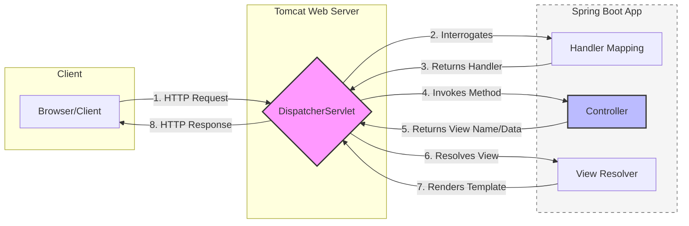

# Spring MVC Request Flow
This application follows the standard Spring Boot web request lifecycle using an embedded Apache Tomcat servlet container.

### 1. Request Initiation
The client (browser or API tool) sends an HTTP Request (GET, POST, etc.) to the server.

### 2. Front Controller (DispatcherServlet)
Tomcat receives the request and passes it to the DispatcherServlet. This acts as the Front Controller, centralizing all incoming traffic to manage the flow of the application.

### 3. Handler Mapping
The DispatcherServlet consults the HandlerMapping. It looks at the URL path and HTTP method to determine which specific @Controller and method (handler) should process the request.

### 4. Controller Execution
The DispatcherServlet dispatches the request to the identified Controller.

The Controller executes the business logic.

It returns a ModelAndView object (containing the data model and the logical view name).

### 5. View Resolution
The ViewResolver takes the logical view name (e.g., "dashboard") and resolves it to a physical resource (e.g., /WEB-INF/views/dashboard.jsp or a Thymeleaf template).

### 6. View Rendering
The DispatcherServlet renders the view by merging the model data with the template. The final HTTP Response is then sent back through Tomcat.

### 7. Client Presentation
The browser receives the response and renders the HTML/JSON data for the user.
